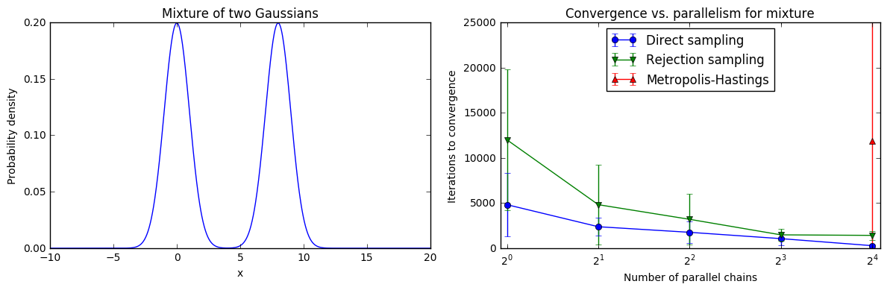
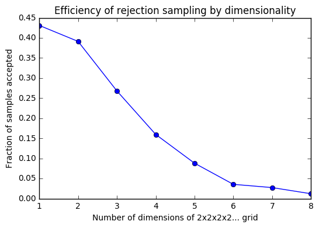
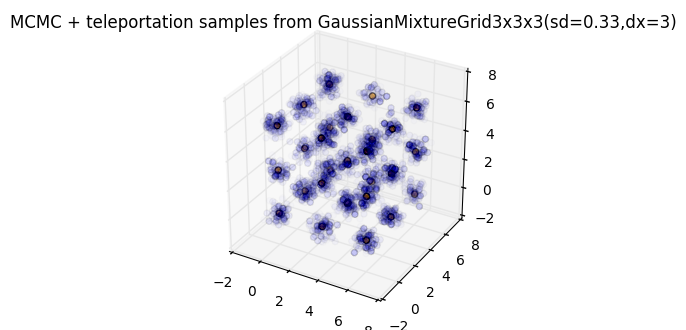

# CS205 Spring 2017 Project: Parallel MCMC

Laith Alhussein, Nathaniel Burbank, Shawn Pan, Andrew Ross, and Rohan
Thavarajah

## Background

Markov Chain Monte Carlo (MCMC) is a statistical method that allows us to draw
samples from complicated probability distributions for which we can only
calculate relative likelihoods between locations. It operates by starting at a
particular location on the distribution, proposing a next location, and making
a random decision to move or stay put based on that relative likelihood. After
many iterations of this process, the resulting "trace" of locations converges
to samples from the distribution of interest -- if the process by which the
algorithm proposes and chooses points satisfies a condition known as detailed
balance.

MCMC is a major enabler of "big science"; beyond pure statistics, many
important simulations in physics, chemistry, and even weather forecasting
[cite] involve taking samples or averages (computed from samples) of
distributions intractable to direct integration.

However, MCMC suffers from a major problem when it comes to _multimodal_
distributions. These are cases in which there exist multiple disjoint outcome
regions that are each equally likely. In particular, the local stepping method
which lets MCMC algorithms handle intractable distributions is exactly what
hampers it from multimodal sampling; to move from one mode to another, the
chain must bridge a chasm of very low probability density, which is unlikely.
In these cases, the MCMC chain frequently gets “stuck” in one of the modes and
fails to converge. The results from a trace generated under these
circumstances are biased and no longer representative of the distribution we
were attempting to sample from.

In theory, even with a multimodal distribution a chain run for an infinite
number of iterations will eventually explore all of the modes if we use a
proposal distribution whose support is infinite. Additionally, running
parallel chains may also help, as would more high-powered proposal methods
like Hamiltonian Monte-Carlo (HMC), which introduces the concept of momentum
to allow the chain to more efficiently explore its space. In practice however,
even with many chains run in parallel for many iterations, we still may not
solve the problem efficiently.

## MCMC and Parallel Computing

For a distribution we know beforehand, there are a variety of convergence
metrics we can apply (which we will detail later). We can analyze the extent to
which parallelism helps us converge faster in the framework of parallel
computing. In particular, for a given MCMC algorithm and a given distribution,
we can define `T₁` as the number of iterations required to converge for a
single chain, and `T∞` as the number of iterations required to converge if we
combine results from an infinite number of parallel chains. For many
distributions, there is some "burnin" `B`, which is the number of samples we
need to discard from the beginning of the chain that are unrepresentative,
since they depend on the arbitrary location where we start (not on the
distribution itself). In this case, we actually have `T∞ = B+1`, since we can
take one sample from infinitely many chains after burnin.

Following this analysis, we can plot speedup, efficiency, and cost graphs for a
number of sampling algorithms on a number of different distributions. For
example, here is a comparison of how the convergence time of three sampling
methods on a simple, 1D Gaussian mixture varies with the degree of parallelism
of the sampler:

where we defined "convergence time" as the number of iterations until the
sample mean stayed within 0.05 of the true mean for a large number of iterations.

Note that direct sampling is the most reliable and fastest to converge, while
rejection sampling is less efficient and has higher variance (since it must
reject a large percentage of the samples it draws). Metropolis-Hastings, the
classic MCMC algorithm, fails to converge entirely even with 50,000 iterations
per chain until we concatenate together 16 parallel chains because it cannot
handle even basic multimodality efficiently.

However, in general, direct sampling isn't usually possible for problems we
care about, and the efficiency of rejection sampling drops exponentially as we
increase the number of dimensions:

So we generally must use local sampling techniques. But rather than trying to
speed up their convergence by adding more parallel machines running the same
unsuitable algorithm, we can parallelize the problem in a different way to
allow faster convergence.

## Teleporting Parallel MCMC

The intuition behind this approach is to combine MCMC (which efficiently
produces biased samples) with rejection sampling (which inefficiently produces
unbiased samples). On one set of nodes, we run many parallel copies of an
inefficient rejection sampler for a distribution `s` that only has a
probability `ɛ` of generating a sample. Whenever we generate a sample, we send
it asynchronously via MPI to a shared buffer.

On another set of nodes, we run many parallel copies of an efficient but biased
MCMC sampler that normally uses a symmetric proposal `p(x2|x1)` and accepts
proposals with probability `min(1, p(x2|x1)s(x2)/p(x1|x2)s(x2)) = min(1,
s(x2)/s(x1))`. However, these MCMC samplers are modified to _teleport_ with
probability `ɛ` to a random rejection sample they claim from the shared
buffer (which they always accept). We can see that this modified proposal still
satisfies detailed balance:

If a rejection sample is unavailable, we block until one is generated, but
because the teleportation probability is related to the rate at which we can
generate rejection samples (and because we have many nodes independently
generating rejection samples), we are unlikely to be blocked by the
unavailability of samples. This process ideally allows us to calculate unbiased
expectations using MCMC even though our target distribution is multimodal.

To evaluate this method, we would determine if:
- sampling with teleportation gives more accurate expectations than sampling
  without, for various proposals and numbers of iterations
- splitting nodes between rejection sampling and MCMC performs better than
  simply allocating all nodes to one or the other
- there is an ideal ratio / teleportation probability `ɛ` for a given
  distribution `s` that determines how we should allocate our nodes

## Implementation

We have implemented this teleporting scheme in sequential code, but plan to parallelize
it using MPI (for interchain communication and aggregation) and OpenMP (to
parallelize rejection sampling locally on each node).

We have parallelized the normal MCMC algorithms with MPI on Odyssey (using
[pymc3](http://pymc-devs.github.io/pymc3/) and
[mpi4py](https://bitbucket.org/mpi4py/mpi4py)). [Code is available
here](https://github.com/asross/cs205-project/blob/master/odyssey_setup/pymc3_mpi_test/pymc3_mpi_test.py).

## Evaluation

### Synthetic Data

A natural model to test these methods on is a mixture of Gaussians. These
distributions are naturally multimodal, but their full distribution is known
and easy to sample from, so we can easily evaluate a number of exact rather
than approximate convergence metrics. We can also vary the parameters of the
mixture (i.e. the proximity and width of each mode as well as the number of
modes and dimensions) and evaluate how our convergence metrics differ under
these conditions.

For the above mixture of 2D Gaussians, which overlap significantly, it is easy
for MCMC methods to converge quickly:

However, when we try to sample from a lattice of 3D Gaussians, convergence is
more difficult to achieve:

If we switch to our teleporting sampler (with `ɛ≈0.05`), our samples appear
much less biased:

We are working on larger scale convergence results for this scheme vs. MCMC vs.
rejection sampling, as well as finding a suitable real-world dataset to test
against.

## Alternative Convergence metrics
