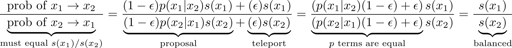
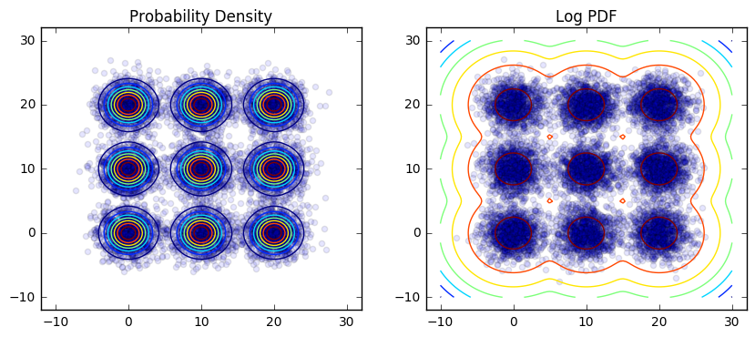
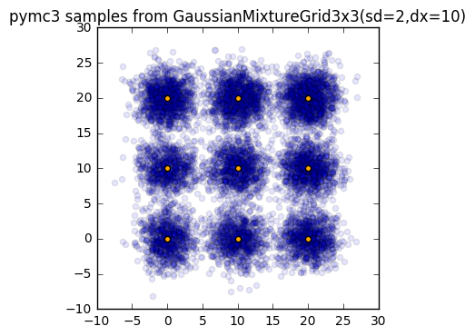
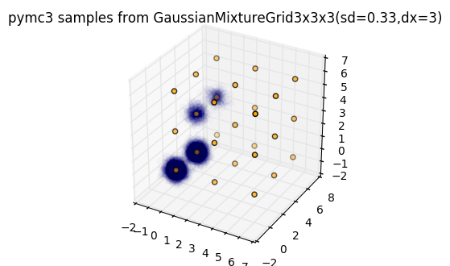

# CS205 Spring 2017 Project: Parallel MCMC

Laith Alhussein, Nathaniel Burbank, Shawn Pan, Andrew Ross, and Rohan
Thavarajah

## Background

Markov Chain Monte Carlo (MCMC) is a statistical method that allows us to draw
samples from complicated probability distributions for which we can only
calculate relative likelihoods between locations. It operates by starting at a
particular location on the distribution, proposing a next location, and making
a random decision to move or stay put based on that relative likelihood.  After
many iterations of this process, the resulting "trace" of locations converges
to samples from the distribution of interest -- if the process by which you
propose and choose points satisfies a condition known as detailed balance.

MCMC is a major enabler of "big science"; beyond pure statistics, many
important simulations in physics, chemistry, and even weather forecasting
[cite] involve taking samples or averages (computed from samples) of
distributions intractable to direct integration.

However, MCMC suffers from a major problem when it comes to _multimodal_
distributions, i.e. cases in which multilple disjoint outcome regions are each
likely. In particular, the local stepping method which lets it handle
intractable distributions is exactly what hampers it from multimodal sampling;
to move from one mode to another, the chain must bridge a chasm of very low
probability density, which is unlikely. In these cases, MCMC fails to converge,
and the results obtained from using it are biased.

Theoretically, however, one _can_ run a chain for an infinite number of
iterations, and it will eventually explore all of the modes if we use a
proposal distribution whose support is infinite. Running parallel chains may
help, as can more high-powered proposal methods like Hamiltonian Monte-Carlo,
which introduces the concept of momentum to allow the chain to more efficiently
explore its space. But even with many chains in parallel for many iterations,
we still may not solve the problem efficiently.

## MCMC and Parallel Computing

For a distribution we know beforehand, there are a variety of convergence
metrics we can apply (which we will detail later). We can analyze the extent to
which parallelism helps us converge faster in the framework of parallel
computing. In particular, for a given MCMC algorithm and a given distribution,
we can define `T₁` as the number of iterations required to converge for a
single chain, and `T∞` as the number of iterations required to converge if we
combine results from an infinite number of parallel chains. For many
distributions, there is some "burnin" `B`, which is the number of samples we
need to discard from the beginning of the chain that are unrepresentative,
since they depend on the arbitrary location where we start (not on the
distribution itself). In this case, we actually have `T∞ = B+1`, since we can
take one sample from infinitely many chains after burnin.

Following this analysis, we can plot speedup, efficiency, and cost graphs for a
number of MCMC algorithms on a number of different distributions:

* _insert plot here, Tp vs. p_

For this distribution (_insert math here_), the cost-optimal number of chains
was **n**.

However, when given a multimodal distribution that _x_ method of MCMC struggles
to handle, we find that convergence takes an extremely long time:

* _insert plot here?_

In this case, rather than trying to speed up convergence by adding more
parallel machines running the same unsuitable algorithm, we can parallelize the
problem in a different way to allow faster convergence.

## Teleporting Parallel MCMC

Rejection sampling is another method for sampling from intractable
distributions. It operates by sampling from a tractable distribution that
"covers" the intractable distribution (multiplied by a constant to raise it
higher), then only accepting it with probability proportional to the ratio of
the tractable and intractable distributions. In high dimensions, it is much
less efficient than MCMC because the covering distribution will likely be a
very loose fit over the distribution of interest, and we only accept samples
with probability proportional to the volume of filled to empty space (which
shrinks exponentially with more dimensions). But it has the advantage of
producing completely uncorrelated samples from the entire distribution
regardless of multimodality.

* _rejection sampling efficiency by dimensionality_

The basic idea of "teleporting" parallel MCMC is to combine inefficient but
unbiased rejection sampling with efficient but biased MCMC. On one set of
nodes, we run many parallel copies of an inefficient rejection sampler for `s`
that only has a probability `\epsilon` of generating a sample. Whenever we
generate a sample, we send it asynchronously via MPI to a shared buffer.

On another set of nodes, we run many parallel copies of an efficient but biased
MCMC sampler that normally uses a symmetric proposal `p(x2|x1)` and accepts
proposals with probability `min(1, p(x2|x1)s(x2)/p(x1|x2)s(x2)) = min(1,
s(x2)/s(x1))`. However, these MCMC samplers are modified to _teleport_ with
probability `\epsilon` to a random rejection sample they claim from the shared
buffer (which they always accept). We can see that this modified proposal still
satisfies detailed balance:

If a rejection sample is unavailable, we block until one is generated, but
because the teleportation probability is related to the rate at which we can
generate rejection samples (and because we have many nodes independently
generating rejection samples), we are unlikely to be blocked by the
unavailability of samples. This process ideally allows us to calculate unbiased
expectations using MCMC even though our target distribution is multimodal.

To evaluate this method, we would determine if:
- sampling with teleportation gives more accurate expectations than sampling
  without, for various proposals and numbers of iterations
- splitting nodes between rejection sampling and MCMC performs better than
  simply allocating all nodes to one or the other
- there is an ideal ratio / teleportation probability `\epsilon` for a given
  distribution `s` that determines how we should allocate our nodes

## Implementation

TODO

## Evaluation

### Synthetic Data

A natural model to test these methods on is a mixture of Gaussians. These
distributions are naturally multimodal, but their full distribution is known
and easy to sample from, so we can easily evaluate a number of exact rather
than approximate convergence metrics. We can also vary the parameters of the
mixture (i.e. the proximity and width of each mode as well as the number of
modes and dimensions) and see what happens to convergence times.

For the above mixture of 2D Gaussians, which overlap significantly, it is easy
for MCMC methods to converge quickly:

However, when we try to sample from a lattice of 3D Gaussians, convergence is
more difficult to achieve:

